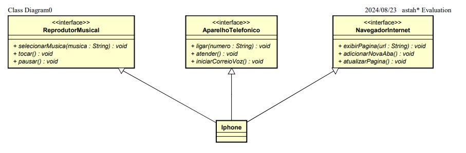

## Getting Started

Para esse Desafio eu elaborei o diagrama de classe abaixo:

<>

## Folder Structure

Esse workspace contem algumas pastas para organização, onde:

- `bin`: os arquivos de saída compilados serão gerados na pasta bin por padrão.
- `lib`: a pasta para manter as dependências
- `src`: a pasta para manter as fontes
- `img`: pasta onde contem nossas imagens do projeto
- `aparelho`: a pasta onde organizamos as funcionalidades e o tipo do aparelho
- `usuario`: a pasta onde contem nossa classe main para execução do codigo

## Minhas Redes

## Habilidades

## GitHub Status

